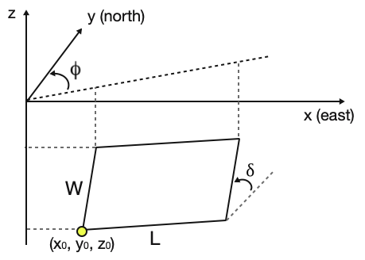

# okada92_tensile
Okada 1992 analytical model for internal deformation due to a tensile crack

Solves for the internal deformation due to a rectangular tensile crack opening in an elastic medium at some point below the free surface (can also solve at the free surface as per Okada 1985).

Code outputs displacements and their derivatives.

The basic_setup.m code runs a single case given the user-defined parameters as show below:

The dipangletest.m code iterates through a suite of dip angles (delta).

The zleveltest.m code iterates through a suite of z-values at which the solution is evaluated.

